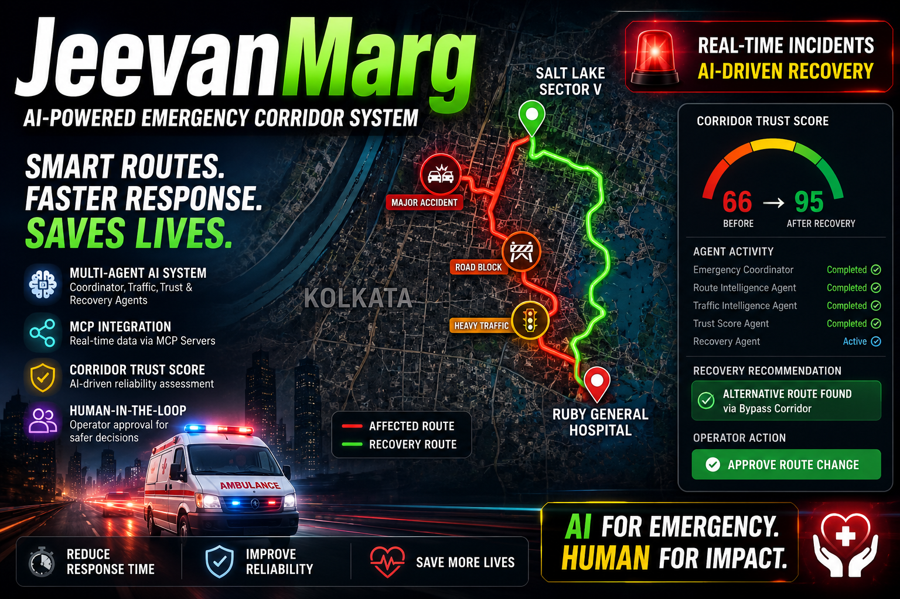
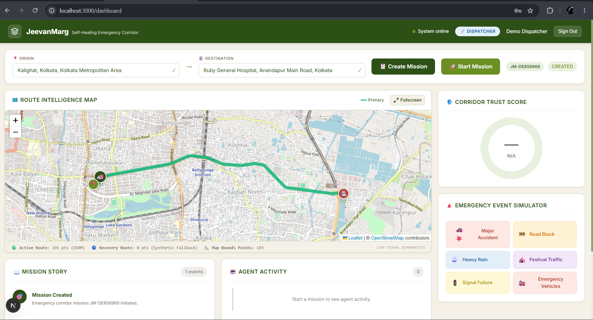
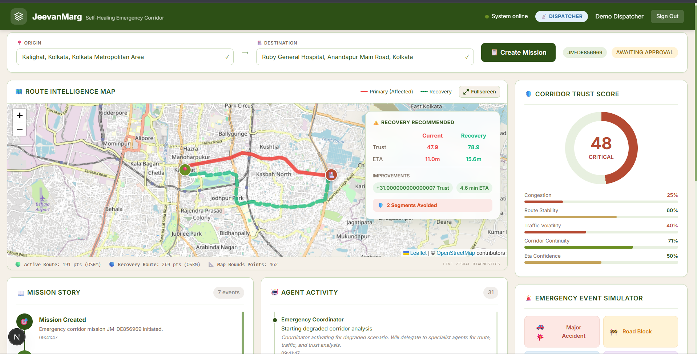
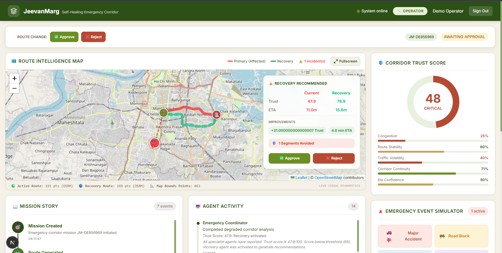
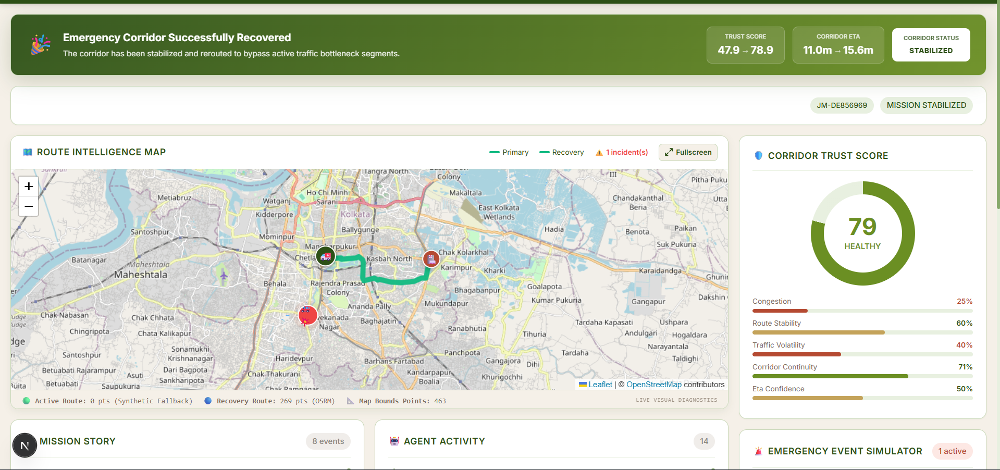
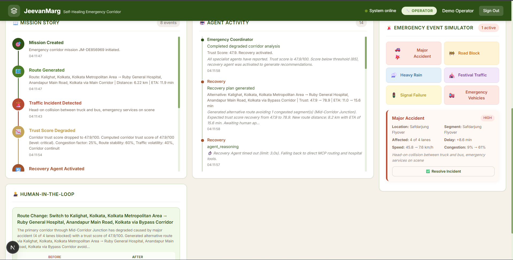

<p align="center">
  
</p>

<h1 align="center">🚑 JeevanMarg</h1>

<h3 align="center">
Self-Healing Emergency Corridor AI Multi-Agent System
</h3>

<p align="center">
AI Multi-Agent Emergency Corridor Reliability & Recovery Platform built using Google ADK, FastMCP, FastAPI and Next.js.
</p>

<p align="center">


</p>

---

# 🚨 Overview

Every second matters during a medical emergency.

Traditional navigation systems are excellent at finding the fastest route, but they do not continuously evaluate whether an emergency corridor remains reliable after unexpected disruptions such as accidents, congestion, roadblocks, or changing traffic conditions.

**JeevanMarg** introduces an AI-powered multi-agent system that continuously evaluates emergency corridor reliability instead of only route length.

> 🚗 **Google Maps optimizes routes.**  
> 🚑 **JeevanMarg optimizes corridor reliability.**

Using **Google ADK**, multiple specialized AI agents collaborate to monitor corridor health, compute a dynamic Trust Score, detect degradation, recommend recovery actions, and involve human operators before applying critical route changes.

---

# 🎯 Problem Statement

Emergency vehicles frequently lose valuable minutes because traffic conditions can change after a route has already been selected.

Traditional navigation systems cannot continuously reason about corridor reliability throughout an active emergency mission.

This often results in:

- 🚧 Unexpected road blockages
- 🚦 Severe traffic congestion
- 🚑 Increased ambulance response time
- 📉 Reduced route reliability
- ⚠️ Reactive instead of proactive decision-making

---

# 💡 Solution

JeevanMarg continuously monitors an emergency corridor using multiple AI agents working together.

Whenever corridor reliability decreases below a safe threshold, the platform automatically:

- 📍 Detects corridor degradation
- 📊 Computes a dynamic Trust Score
- 🚧 Generates a recovery strategy
- 🛣️ Suggests an alternative route
- 👨‍⚕️ Requests Human-in-the-Loop approval
- 🚑 Stabilizes the emergency mission

Rather than replacing human operators, JeevanMarg provides intelligent decision support for faster and more reliable emergency response.

---

# 🤖 Why Multi-Agent AI?

Emergency corridor management involves multiple independent reasoning tasks.

Instead of relying on a single AI model, JeevanMarg decomposes the workflow into specialized AI agents orchestrated through **Google ADK**.

This architecture provides:

- ✅ Modular reasoning
- ✅ Explainable decision-making
- ✅ Better scalability
- ✅ Independent agent responsibilities
- ✅ Easier maintenance
- ✅ Reusable MCP tools

FastMCP enables each agent to access routing, traffic, trust evaluation, and hospital services through dedicated MCP servers.

---

# 🏗️ System Architecture

<p align="center">

</p>

### AI Workflow

```
Emergency Coordinator
        │
        ▼
 Route Intelligence Agent
        │
        ▼
 Traffic Intelligence Agent
        │
        ▼
 Trust Score Agent
        │
        ▼
Trust Below Threshold?
        │
      YES
        │
        ▼
 Recovery Agent
        │
        ▼
 Human Approval
        │
        ▼
 Corridor Stabilized
```

The **Emergency Coordinator Agent** orchestrates all specialist agents through **Google ADK**.

Each AI agent communicates with dedicated **FastMCP Servers**, enabling modular reasoning and reusable tool execution.

---

# 📸 Project Preview

## Dashboard

> *(Add your dashboard screenshot here later.)*

---

## System Architecture

<p align="center">

</p>

---

## Healthy Corridor

<p align="center">

</p>

---

## Incident Simulation

<p align="center">

</p>

---

## Recovery Recommendation

<p align="center">

</p>

---

## Mission Stabilized

<p align="center">

</p>

---
# 🛠️ Technology Stack

| Layer | Technology |
|--------|------------|
| **Frontend** | Next.js 15, React, TypeScript, Tailwind CSS |
| **Backend** | FastAPI, Python |
| **AI Framework** | Google ADK |
| **MCP Framework** | FastMCP |
| **Database** | SQLite |
| **Routing** | OSRM |
| **Maps** | Leaflet.js |
| **Authentication** | JWT |
| **Realtime Communication** | WebSockets |
| **Deployment** | Docker |

---

# 🤖 AI Multi-Agent System

JeevanMarg follows a modular **Google ADK Multi-Agent Architecture** where every agent has a single responsibility while collaborating through an orchestrator.

## 🚑 Emergency Coordinator Agent

The Coordinator acts as the brain of the system.

Responsibilities:

- Orchestrates all AI agents
- Controls mission lifecycle
- Manages agent execution order
- Coordinates recovery workflow
- Handles Human-in-the-Loop approvals

---

## 🗺️ Route Intelligence Agent

Responsible for route planning.

### Responsibilities

- Generate emergency route
- Estimate ETA
- Generate recovery route
- Evaluate alternative corridors

### Uses

- Route MCP Server

---

## 🚦 Traffic Intelligence Agent

Continuously monitors traffic conditions.

### Responsibilities

- Detect congestion
- Evaluate bottlenecks
- Monitor corridor degradation
- Analyze road conditions

### Uses

- Traffic MCP Server

---

## 📊 Trust Score Agent

Evaluates overall emergency corridor reliability.

### Trust Score Factors

- Corridor Continuity
- Congestion Level
- ETA Confidence
- Route Stability
- Traffic Volatility

The final Trust Score determines whether the corridor is considered healthy or requires recovery.

---

## 🔄 Recovery Agent

Activated whenever corridor reliability drops below the acceptable threshold.

Responsibilities

- Generate alternative routes
- Compare recovery options
- Estimate improvements
- Submit recommendation for operator approval

---

# 🔗 FastMCP Servers

Each AI agent communicates with external tools through dedicated **FastMCP Servers**, keeping reasoning separate from tool execution.

---

## 🛣️ Route MCP

Available Tools

- `generate_route()`
- `estimate_eta()`
- `generate_alternative_route()`

Purpose

Provides emergency route generation and recovery routing using OSRM.

---

## 🚦 Traffic MCP

Available Tools

- `get_traffic_status()`
- `get_congestion_risk()`
- `get_segment_speed()`

Purpose

Analyzes corridor traffic conditions and congestion.

---

## 📊 Trust MCP

Available Tools

- `calculate_trust_score()`
- `assess_reliability()`

Purpose

Computes corridor reliability using weighted trust factors.

---

## 🏥 Hospital MCP

Available Tools

- `get_nearby_hospitals()`
- `get_trauma_centers()`

Purpose

Provides nearby hospital and trauma center information during emergency routing.

---

# ✨ Key Features

- 🤖 Google ADK Multi-Agent Architecture
- 🔗 FastMCP Tool Servers
- 🚑 Emergency Mission Management
- 📊 Dynamic Trust Score Engine
- 🛣️ Alternative Route Generation
- 👨‍⚕️ Human-in-the-Loop Approval
- 🚦 Incident Simulation
- 🌐 Real Road Routing using OSRM
- 🗺️ Interactive Leaflet Maps
- 📡 WebSocket Live Updates
- 🔐 JWT Authentication
- 👥 Dispatcher / Operator / Admin Roles
- 📈 Mission Timeline
- 📋 Agent Activity Logs
- ⚡ MCP Tool Call Monitoring
- 🐳 Docker Ready Deployment

---

# 📊 Real vs Simulated Components

| Component | Status |
|-----------|--------|
| Google ADK Agents | ✅ Real |
| FastMCP Servers | ✅ Real |
| FastAPI Backend | ✅ Real |
| SQLite Database | ✅ Real |
| JWT Authentication | ✅ Real |
| WebSockets | ✅ Real |
| OSRM Road Routing | ✅ Real |
| Leaflet Maps | ✅ Real |
| Incident Simulation | 🔶 Simulated |
| Trust Score Engine | 🔶 Rule-Based |
| Ambulance Dispatch Network | 🔶 Simulated |
| Government Traffic Signals | 🔶 Simulated |

---

# 📂 Project Structure

```text
JeevanMarg-Agent
│
├── backend
│   ├── agents
│   │   └── orchestrator.py
│   ├── app
│   │   ├── routers
│   │   ├── middleware
│   │   ├── models
│   │   ├── schemas
│   │   └── services
│   ├── mcp_servers
│   │   ├── route_mcp.py
│   │   ├── traffic_mcp.py
│   │   ├── trust_mcp.py
│   │   └── hospital_mcp.py
│   └── data
│
├── frontend
│   └── src
│
├── docs
│   ├── images
│   └── architecture.md
│
└── README.md
```

---

# 🎬 Demo Workflow

The complete mission lifecycle follows these steps:

1. Dispatcher creates an emergency mission.
2. Emergency Coordinator launches the AI workflow.
3. Route Agent generates the optimal emergency corridor.
4. Traffic Agent evaluates corridor conditions.
5. Trust Score Agent calculates corridor reliability.
6. A major accident is simulated.
7. Trust Score decreases.
8. Recovery Agent generates an alternative route.
9. Operator reviews the recommendation.
10. Human approval activates the recovery route.
11. Trust Score improves.
12. Mission successfully stabilizes.

---

# 📷 Agent Activity

<p align="center">

</p>

---

# 🚀 Mission Lifecycle

```text
Mission Created
        │
        ▼
AI Agents Activated
        │
        ▼
Route Generated
        │
        ▼
Traffic Monitored
        │
        ▼
Trust Score Calculated
        │
        ▼
Incident Detected
        │
        ▼
Recovery Recommendation
        │
        ▼
Human Approval
        │
        ▼
Alternative Route Activated
        │
        ▼
Mission Stabilized
```

---
# 🚀 Quick Start

## Prerequisites

Before running the project, ensure you have:

- Python 3.11+
- Node.js 20+
- npm
- Google Gemini API Key
- Git

---

# 📥 Clone Repository

```bash
git clone https://github.com/<your-username>/JeevanMarg-Agent.git

cd JeevanMarg-Agent
```

---

# ⚙️ Backend Setup

```bash
cd backend

python -m venv .venv

# Windows
.venv\Scripts\activate

# Linux / macOS
source .venv/bin/activate

pip install -r requirements.txt

python -m uvicorn app.main:app --reload --port 8000
```

Backend will start at

```
http://localhost:8000
```

Swagger API

```
http://localhost:8000/docs
```

---

# 💻 Frontend Setup

```bash
cd frontend

npm install

npm run dev
```

Frontend

```
http://localhost:3000
```

---

# 🔑 Environment Variables

Create

```
backend/.env
```

using

```
backend/.env.example
```

Add your Gemini API key

```env
GOOGLE_API_KEY=YOUR_API_KEY
JWT_SECRET_KEY=YOUR_SECRET_KEY
```

⚠️ Never commit API keys or secrets to GitHub.

---

# 👤 Demo Credentials

| Role | Username | Password |
|------|----------|----------|
| Dispatcher | dispatcher | dispatch123 |
| Operator | operator | operate123 |
| Admin | admin | admin123 |

---

# 🔐 Security Features

JeevanMarg incorporates several security mechanisms to ensure safe access and controlled decision-making.

### Authentication

- JWT Authentication
- Password Hashing using bcrypt
- Protected REST APIs

### Authorization

Role-Based Access Control (RBAC)

- Dispatcher
- Operator
- Administrator

### Human-in-the-Loop

Critical recovery recommendations are **never applied automatically**.

Every alternative route requires operator review and approval before activation.

This ensures accountability while keeping humans in control of critical emergency decisions.

---

# 🐳 Docker Deployment

Backend

```bash
docker build -f Dockerfile.backend -t jeevanmarg-backend .
```

Frontend

```bash
docker build -f Dockerfile.frontend -t jeevanmarg-frontend .
```

Or use Docker Compose

```bash
docker compose up --build
```

---

# ☁️ Deployability

JeevanMarg has been designed with deployment in mind.

The project is containerized using Docker and follows a modular architecture, making it suitable for deployment on cloud platforms such as:

- Google Cloud Run
- Azure App Service
- AWS ECS
- Railway
- Render

Although this submission runs locally for demonstration purposes, the architecture supports cloud deployment with minimal modifications.

---

# 🎥 Demonstration

The complete project walkthrough is available on YouTube.

📺 **Demo Video**

> *(Replace with your YouTube link)*

```
https://youtu.be/YOUR_VIDEO_LINK
```

---

# 📚 Documentation

Additional documentation is available inside the **docs/** directory.

- Architecture
- Agent Workflow
- Screenshots
- System Design

---

# 🌍 Future Improvements

Some planned enhancements include:

- Live Google Maps Traffic Integration
- Ambulance GPS Tracking
- Hospital Capacity Prediction
- AI-powered Congestion Forecasting
- Government Traffic Signal Integration
- Multi-city Deployment
- Mobile Application
- Cloud-native Scaling
- Real Emergency Dispatch APIs

---

# 🏆 Kaggle Capstone

This project was developed as part of the

**Google AI + Kaggle**
**5-Day AI Agents Intensive — Vibe Coding Capstone**

The implementation demonstrates:

- ✅ Google ADK Multi-Agent Systems
- ✅ FastMCP Servers
- ✅ Human-in-the-Loop AI
- ✅ Security Features
- ✅ Agent Skills
- ✅ Modular Architecture
- ✅ Deployable Design

---

# 🙏 Acknowledgements

Special thanks to:

- Google AI Developer Platform
- Google ADK
- FastMCP
- Kaggle
- FastAPI
- Next.js
- OSRM
- Leaflet
- Open Source Community

---

# 📄 License

This project is licensed under the MIT License.

See the **LICENSE** file for more information.

---

<h2 align="center">

⭐ If you found this project interesting, consider giving it a star!

</h2>

<h3 align="center">

🚑 Building safer emergency response systems through AI.

</h3>
