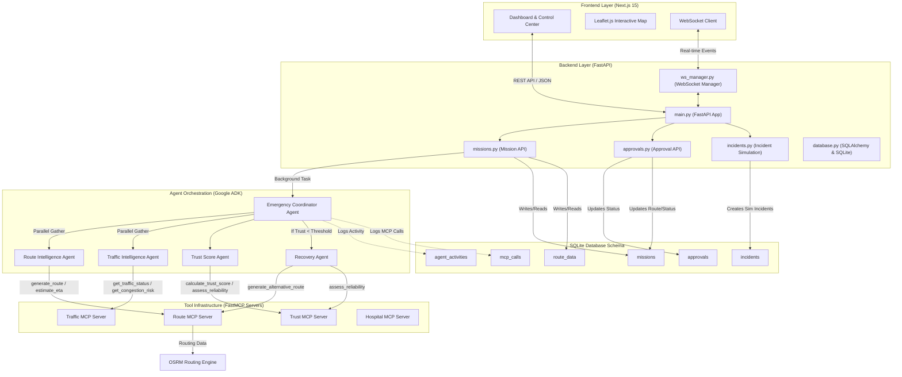
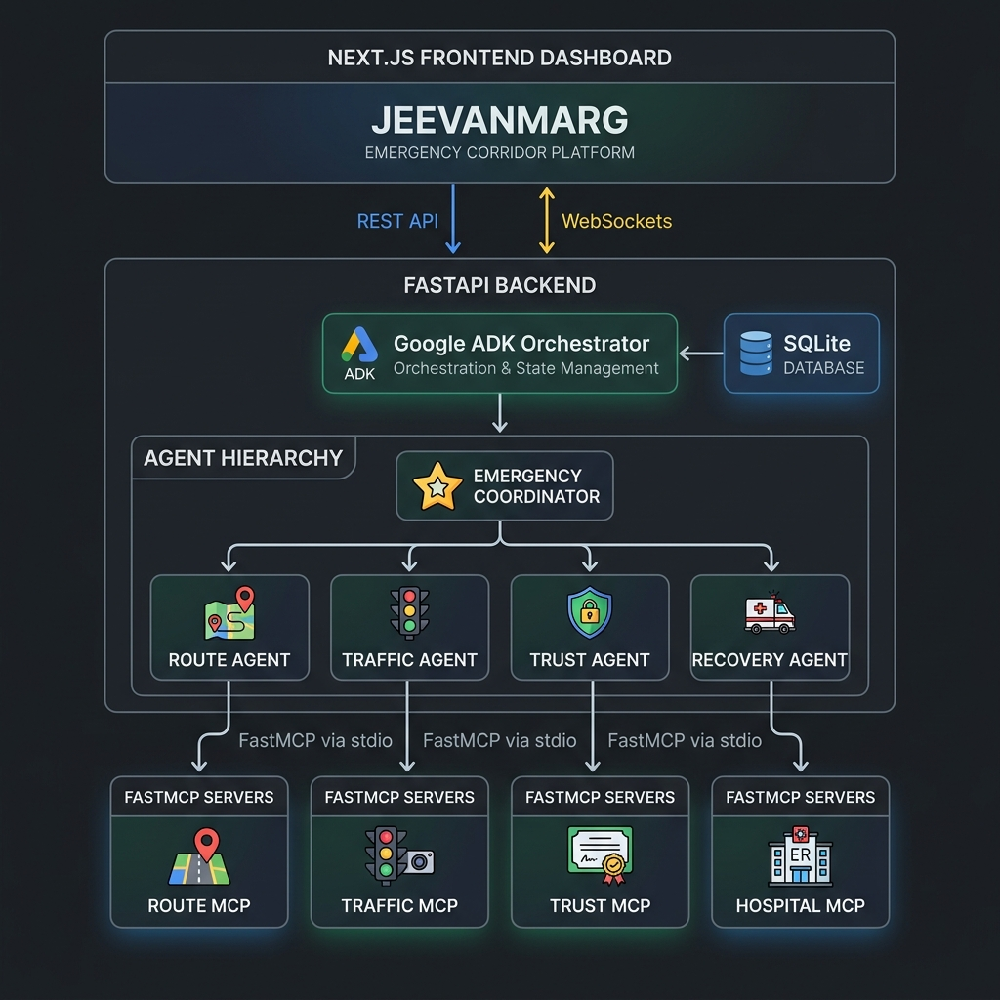

# 🚑 JeevanMarg — System Architecture

JeevanMarg is an AI Multi-Agent emergency corridor management and reliability platform. It is designed to ensure that emergency vehicles (e.g., ambulances) travel along corridors that are not only the fastest under normal conditions, but are also continuously monitored, assessed for risk, and dynamically repaired or bypassed (self-healed) when unexpected delays or incidents occur.

This document details the high-level architecture, individual components, agent orchestrator hierarchy, tool servers, database models, and the self-healing workflow.

---

## 🏗️ System Overview

The system consists of three main tiers:
1. **Next.js 15 Frontend Dashboard**: Visualizes the corridors, active incidents, real-time agent reasoning log, and handles human-in-the-loop recovery approvals.
2. **FastAPI Backend Services**: Orchestrates the API requests, runs simulation scenarios, manages database operations, and streams events via WebSockets.
3. **AI Multi-Agent System & FastMCP Tool Servers**: Uses **Google ADK** (Agent Development Kit) for multi-agent reasoning, and **FastMCP** stdio-based servers for exposing routing, traffic, and trust score computation tools.



---

## 📷 Architecture Diagram



---

## 💻 Tech Stack & Components

### 1. Frontend: Next.js Dashboard
- **Location**: `frontend/` (entry page: [page.tsx](file:///c:/Users/kunwa/Desktop/JeevanMarg-Agent/frontend/src/app/page.tsx), dashboard: [page.tsx](file:///c:/Users/kunwa/Desktop/JeevanMarg-Agent/frontend/src/app/dashboard/page.tsx))
- **Technologies**: Next.js 15, TypeScript, Tailwind CSS, Leaflet.js
- **Key Features**:
  - **Interactive Map**: Displays the ambulance's path, emergency checkpoints, hospitals, and real-time traffic incidents. Shows the current active route and overlays the proposed bypass route when a corridor degrades.
  - **Live Console**: Subscribes to the WebSocket server to stream real-time agent outputs, reasoning thoughts, and Model Context Protocol (MCP) tool executions.
  - **Human-in-the-loop Panel**: Shows pending route approvals, detailing the before-and-after Trust Score, ETA improvements, and a concise AI reasoning justification.
  - **Role-Based Views**: Support for Dispatchers (create missions), Operators (review & approve recovery recommendations), and Administrators.

### 2. Backend: FastAPI Service
- **Location**: `backend/` (app initialization: [main.py](file:///c:/Users/kunwa/Desktop/JeevanMarg-Agent/backend/app/main.py))
- **Technologies**: FastAPI, SQLAlchemy (Async), Uvicorn, SQLite
- **Key Features**:
  - **REST APIs**: Separate routers for user authentication ([auth.py](file:///c:/Users/kunwa/Desktop/JeevanMarg-Agent/backend/app/routers/auth.py)), mission tracking ([missions.py](file:///c:/Users/kunwa/Desktop/JeevanMarg-Agent/backend/app/routers/missions.py)), simulation control ([incidents.py](file:///c:/Users/kunwa/Desktop/JeevanMarg-Agent/backend/app/routers/incidents.py)), and human approvals ([approvals.py](file:///c:/Users/kunwa/Desktop/JeevanMarg-Agent/backend/app/routers/approvals.py)).
  - **WebSockets Manager**: Exposes a subscription channel ([ws_manager.py](file:///c:/Users/kunwa/Desktop/JeevanMarg-Agent/backend/app/services/ws_manager.py)) to broadcast live agent and mission events directly to the frontend.
  - **Background Worker**: Offloads heavy AI multi-agent runs to background tasks, avoiding API request blockage.

### 3. Agent Orchestrator: Google ADK
- **Location**: `backend/agents/` (orchestrator: [orchestrator.py](file:///c:/Users/kunwa/Desktop/JeevanMarg-Agent/backend/agents/orchestrator.py))
- **Technologies**: Google Agent Development Kit (`google-adk`), Gemini (defaults to `gemini-2.5-flash`)
- **Key Features**:
  - **Emergency Coordinator Agent**: Acts as the orchestrator. Manages the scenario phases, executes specialized sub-agents, aggregates their results, and decides whether recovery actions should be taken.
  - **Route Intelligence Agent**: Generates routes and computes ETAs. Equipped with the Route MCP tools.
  - **Traffic Intelligence Agent**: Analyzes congestion, lanes affected, and detects bottlenecks. Equipped with Traffic MCP tools.
  - **Trust Score Agent**: Calculates the multi-factor trust score (0–100) using a weighted analysis formula. Equipped with Trust MCP tools.
  - **Recovery Agent**: Activated when trust falls below a warning threshold (e.g. 70). Formulates alternative corridors avoiding the congested segments and drafts human approval recommendations.

### 4. Tool Infrastructure: FastMCP Servers
- **Location**: `backend/mcp_servers/`
- **Technologies**: FastMCP (Model Context Protocol python framework)
- **Servers**:
  - **Route MCP** ([route_mcp.py](file:///c:/Users/kunwa/Desktop/JeevanMarg-Agent/backend/mcp_servers/route_mcp.py)): Exposes `generate_route()`, `estimate_eta()`, and `generate_alternative_route()`. Interfaces with the Open Source Routing Machine (OSRM) API.
  - **Traffic MCP** ([traffic_mcp.py](file:///c:/Users/kunwa/Desktop/JeevanMarg-Agent/backend/mcp_servers/traffic_mcp.py)): Exposes `get_traffic_status()`, `get_congestion_risk()`, and `get_segment_speed()`. Monitors active simulation incidents.
  - **Trust MCP** ([trust_mcp.py](file:///c:/Users/kunwa/Desktop/JeevanMarg-Agent/backend/mcp_servers/trust_mcp.py)): Exposes `calculate_trust_score()` and `assess_reliability()`. Computes reliability using weights: 25% Congestion, 20% Route Stability, 20% Traffic Volatility, 20% Corridor Continuity, and 15% ETA Confidence.
  - **Hospital MCP** ([hospital_mcp.py](file:///c:/Users/kunwa/Desktop/JeevanMarg-Agent/backend/mcp_servers/hospital_mcp.py)): Exposes `get_nearby_hospitals()` and `get_trauma_centers()`. Looks up medical facilities based on geospatial coordinates.

---

## 🗄️ Database Schema & Models

The SQLite database (`jeevanmarg.db`) tracks the states, routes, and history of the missions. The relationships and tables are defined in [models/](file:///c:/Users/kunwa/Desktop/JeevanMarg-Agent/backend/app/models):

### 1. `missions`
Tracks the global state, target destinations, and calculated trust metrics:
* `id` (PK, Integer)
* `mission_code` (String, e.g. "CP-AIIMS-1")
* `status` (Enum: created, running, analyzing, degraded, recovering, awaiting_approval, completed, failed)
* `origin_name`, `origin_lat`, `origin_lng`
* `destination_name`, `destination_lat`, `destination_lng`
* `trust_score` (Float, 0–100)
* `trust_level` (String, e.g. "excellent", "healthy", "warning", "critical")
* `corridor_health` (Float)
* `eta_minutes` (Float)
* `scenario` (String: healthy, degraded, recovered)
* `created_by` (FK -> `users.id`)

### 2. `route_data`
Stores geo-coordinates (waypoints) and segments of the corridors:
* `id` (PK, Integer)
* `mission_id` (FK -> `missions.id`)
* `route_type` (String: primary, alternative)
* `route_name` (String)
* `waypoints` (JSON Array of [lat, lng])
* `segments` (JSON metadata, e.g. speed limits, lengths)
* `distance_km` (Float)
* `eta_minutes` (Float)
* `is_active` (Integer, 0 or 1)
* `route_source` (String, e.g. "OSRM" or "Synthetic")

### 3. `approvals`
Tracks human-in-the-loop recovery requests:
* `id` (PK, Integer)
* `mission_id` (FK -> `missions.id`)
* `approval_type` (String: route_change)
* `title` (String)
* `description` (Text)
* `recommendation` (JSON structured alternative route details)
* `ai_explanation` (Text explanation from the Recovery Agent)
* `trust_score_before`, `trust_score_after`
* `eta_before`, `eta_after`
* `status` (Enum: pending, approved, rejected)
* `reviewed_by` (FK -> `users.id`)

### 4. `incidents`
Stores simulated active or resolved traffic disruptions:
* `id` (PK, Integer)
* `mission_id` (FK -> `missions.id`)
* `incident_type` (Enum: major_accident, road_block, heavy_rain, signal_failure, etc.)
* `severity` (Enum: high, medium, low)
* `status` (Enum: active, resolved)
* `location_name`, `location_lat`, `location_lng`
* `segment_id` (e.g. "seg_02")
* `affected_lanes`, `total_lanes`
* `estimated_delay_minutes`

### 5. `agent_activities` & `mcp_calls`
Provide audit logs of everything the agents do:
* **`agent_activities`**: Logs agent names, states (running, completed, failed), actions, results, and intermediate chain-of-thought reasoning.
* **`mcp_calls`**: Logs exact server name, tool name, request payloads, response payloads, latency, and success status of every MCP call.

---

## 🔄 Self-Healing Operational Flow

The core workflow simulates corridor degradation and triggers self-healing under the supervision of a human operator:

```
[1. Dispatcher creates Mission]
              │
              ▼
[2. Orchestrator: Scenario 1 - "healthy"]
  ├─► Route Agent generates primary corridor (Route MCP)
  ├─► Traffic Agent checks congestion (Traffic MCP)
  └─► Trust Agent evaluates reliability (Trust MCP) ──► Score: ~95/100 (No action)
              │
              ▼
[3. Scenario 2 - "degraded" (Simulated Accident)]
  ├─► Traffic Agent detects road blockage on primary route
  ├─► Trust Agent recalculates trust score ──► Score: ~45/100 (Below Threshold)
  │           │
  │           ▼
  └─► Recovery Agent activated
        ├─► Finds detour avoiding blockage (Route MCP)
        ├─► Estimates improved trust score (Trust MCP)
        └─► Submits Route Change Approval request (WebSocket / Database)
              │
              ▼
[4. Human Operator Review]
  ├─► Dashboard displays before/after metrics
  └─► Operator clicks "Approve" (REST Endpoint)
              │
              ▼
[5. Self-Healing Stabilization]
  ├─► DB updates: alternative route -> active; primary -> inactive
  ├─► Mission scenario status updated to "recovered"
  └─► WebSocket broadcasts stabilization; Dashboard map reroutes
```

1. **Mission Initialization**: A dispatcher submits origin and destination coordinates. FastAPI launches a background thread running `orchestrator.run_mission()`.
2. **Healthy Corridor Assessment**:
   - The Route Agent calls `generate_route` and `estimate_eta`. The route data is saved.
   - The Traffic Agent checks status; everything is clear.
   - The Trust Agent calculates a high Trust Score.
   - The system is marked healthy, and results are broadcast via WebSockets.
3. **Corridor Degradation**:
   - An incident is triggered (e.g., a major accident blocking lanes).
   - In the "degraded" phase of the orchestrator, the Traffic Agent detects the incident and reports severe speed reductions.
   - The Trust Agent calculates a drop in Trust Score (e.g., to 45).
   - Because 45 is below the threshold of 70, the Emergency Coordinator invokes the Recovery Agent.
4. **Recovery Generation**:
   - The Recovery Agent calls `generate_alternative_route` avoiding the blocked road segment.
   - It calculates a recovery ETA and asks the Trust MCP what the estimated score would be on this alternative (e.g., 85).
   - The agent constructs a review package containing the metrics and a natural language justification (`ai_explanation`), then emits an `approval_requested` event.
5. **Human-in-the-Loop Approval**:
   - The background worker pauses. An `Approval` record is created.
   - The operator dashboard displays the request.
   - When the operator clicks "Approve", the backend updates the active route to the alternative, sets the mission scenario to `recovered`, sets the mission status to `completed`, and updates the trust metrics.
   - A WebSocket event triggers the frontend map to switch to the bypass route, completing the corridor self-healing cycle.
